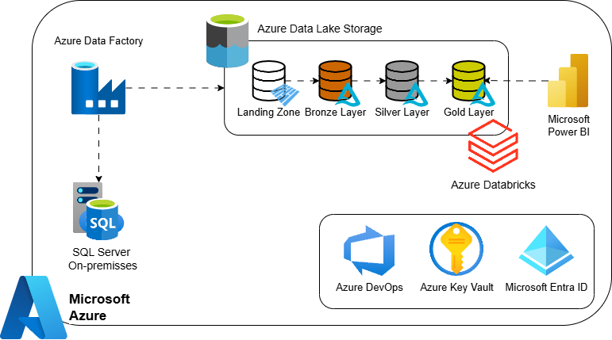
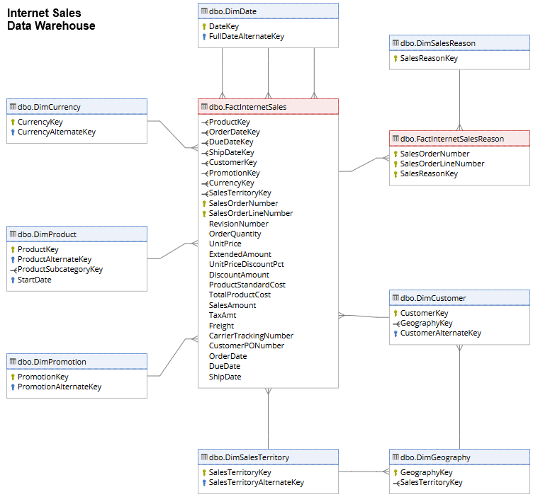
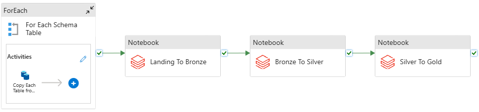
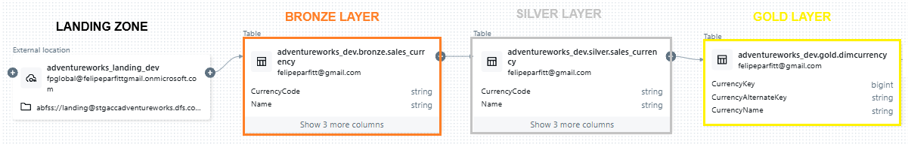
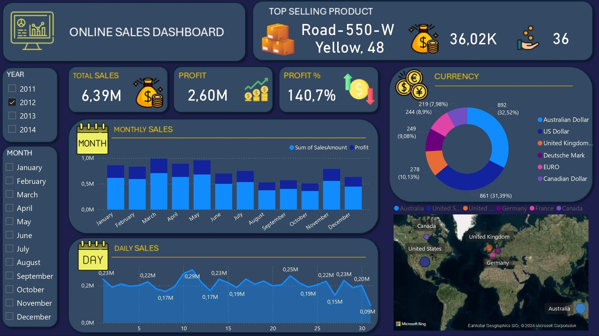

# End to End Azure Data Engineering Project: Building an Internet Sales Data Warehouse

<!--  -->

## Project Objective

The objective of this project is to recreate the Internet Sales Data Warehouse by processing data from the AdventureWorks 2022 OLTP database in SQL Server. The project designs and implements an automated ETL pipeline within Azure, orchestrated by Azure Data Factory, transformed by Azure Databricks, and stored in Azure Data Lake Storage. The pipeline moves data through a medallion architecture (landing, bronze, silver, and gold layers) in Delta Lake, transforming raw data into a clean, structured format. Using Azure Key Vault for secure secrets management and Azure DevOps for CI/CD, the setup ensures consistent data governance, timely updates, and seamless access to Power BI for business intelligence reporting.

The layout of the Internet Sales Data Warehouse, with its dimensions and fact tables, taken from the [Dataeto](https://dataedo.com/samples/html/Data_warehouse/doc/AdventureWorksDW_4/modules/Internet_Sales_101/module.html), can be seen in the figure below.

  

<!--  -->

## Project Assumptions

For the development of the project, the following assumptions were made:

+ **Data Extraction**: The data source is the AdventureWorks 2022 database on SQL Server (OLTP). The data is extracted via Azure Data Factory (ADF) and ingested into the landing zone in Azure Data Lake Storage (ADLS) in Parquet format.

+ **Technology Stack**: Azure Data Factory for orchestration, Azure Databricks (with Delta Lake and Unity Catalog) for data processing and governance, ADLS for storage, Azure Key Vault for secrets management, and Azure DevOps as a code repository and for CI/CD pipeline automation.

+ **Data Processing**: Data is processed using Apache Spark clusters in Azure Databricks in order to build the Delta Lake. The pipeline, managed by Azure Data Factory, handles both the orchestration and monitoring of data workflows.

+ **Medallion Architecture**: The project implements the medallion architecture, with data flowing through the bronze, silver, and gold layers for efficient processing and management.

+ **Reporting and Visualization**: The Internet Sales Data Warehouse, built in the gold layer, serves as the source for Power BI dashboards and reports, providing insights into sales performance and trends.

## Technologies Used in the Project

+ [Azure Data Factory (ADF)](https://azure.microsoft.com/en-us/products/data-factory/): A tool for orchestrating and automating data workflows across various sources.
+ [Azure Data Lake Storage (ADLS)](https://azure.microsoft.com/en-us/products/storage/data-lake-storage/): A scalable and secure storage solution for large volumes of data, supporting both structured and unstructured data.
+ [Azure Databricks (ADB)](https://azure.microsoft.com/en-us/products/databricks/): A data analytics platform that integrates with Apache Spark to process large datasets and perform advanced analytics.
+ [Azure Key Vault (AKV)](https://azure.microsoft.com/en-us/products/key-vault/): A service for securely storing and managing secrets, such as API keys, passwords, and certificates.
+ [Azure DevOps](https://azure.microsoft.com/en-us/products/devops/): A platform for managing code repositories, CI/CD pipelines, and collaborative software development.
+ [Microsoft Entra ID](https://www.microsoft.com/pt-br/security/business/identity-access/microsoft-entra-id): An identity and access management service that provides secure authentication and authorization for users.
+ [Microsoft Power BI](https://www.microsoft.com/pt-br/power-platform/products/power-bi): A business intelligence tool used for creating data visualizations, reports, and dashboards to support decision-making. 

## Motivations for Using Each Technology

+ **Azure Data Factory**: Provides a centralized platform to orchestrate and automate the entire data workflow. It facilitates the extraction of data from the SQL Server-based AdventureWorks database and manages the movement of data into the landing zone in ADLS. Additionally, it triggers ADB notebooks to transform data from the bronze layer to silver, and then to the gold layer.

+ **Azure Data Lake Storage**: Selected for its low cost and ability to store any type of data, including both raw and processed data. It stores raw data in Parquet format in the landing zone and processed data in Delta format across the medallion architecture's bronze, silver, and gold layers.

+ **Azure Databricks**: Provides a powerful environment for processing large datasets using Spark. It is crucial for creating and managing Delta Lake tables, enabling efficient data transformations, and implementing the medallion architecture.

+ **Azure Key Vault**: Used to safely store secrets and connection strings, which are essential for securely accessing databases and other services.

+ **Azure DevOps**: Automates the CI/CD pipeline, allowing seamless deployment and version control of the project. It ensures continuous updates when the main branch is modified by pull requests.

+ **Microsoft Entra ID**: Used for authentication and authorization across the platform, ensuring secure access to Azure services and resources.

+ **Microsoft Power BI**: Powers data visualization and reporting, transforming the insights from the gold layer of the Internet Sales Data Warehouse into actionable business intelligence.

## Project Development

  

<!---->

### 1) Initial Stage
The project begins in the on-premises SQL Server environment, where the AdventureWorks 2022 database operates as an OLTP system. The data flow is orchestrated by Azure Data Factory, starting with the extraction of the tables needed to build the Internet Sales Data Warehouse. This process is automated through the Copy Data activity, which, within a ForEach loop, extracts all relevant tables from SQL Server and stores them in Parquet format in the landing zone of Azure Data Lake Storage (ADLS).

### 2) Building the Delta Lake
Once all tables are extracted, the next step is to implement the Medallion Architecture, using Delta Lake to organize the bronze, silver, and gold layers.

a) Bronze Layer:
Data extracted from the landing zone is loaded and stored in Delta format, with additional control columns such as the batch source and the processing date. In this layer, the table’s schema is flexible, allowing the addition of new columns as needed, without disrupting the process.

b) Silver Layer:
After the bronze layer, data undergoes transformation and cleansing in the silver layer. Here, a table is created in Unity Catalog with a fixed schema and defined constraints. This layer applies data quality checks focused on: consistency, accuracy, validity, completeness, timeliness, and uniqueness. Duplicate records are removed, default values are filled where necessary, and all constraints are rigorously validated. Any rows that fail validation are discarded. The schema is strictly enforced, and at the end of the process, data is upserted into the existing table.
 
c) Gold Layer:
The gold layer represents the Data Warehouse. In this phase, tables from the silver layer are combined to build the dimensions and facts of the Data Warehouse. As with the silver layer, a table is first created in Unity Catalog. Necessary tables are then loaded and integrated, performing a denormalization of data to facilitate future queries and analysis. This layer provides an optimized foundation for Power BI, where data is visualized and used to generate dashboards and business insights.

An example of a table flow can be seen in the image below:

  

<!--  -->

### 3) Analysis and Decision Making With Power BI
Power BI is used to create interactive dashboards, providing valuable insights into the company’s sales. These insights enable managers to make informed decisions to optimize operational and strategic outcomes.

The final dashboard can be seen below:

  

<!--  -->

### 4) Additional Information
+ Transformations: All data transformation processes occur in Azure Databricks, leveraging Apache Spark to efficiently process large volumes of data.
+ Code Management: The code that controls the entire pipeline is stored and versioned in Azure DevOps, ensuring automation and tracking of code changes.
+ Security: Sensitive credentials, such as SQL passwords, SQL usernames, and the ADB Access Token, are securely stored in Azure Key Vault. Some connections also use Azure Entra ID for secure authentication.